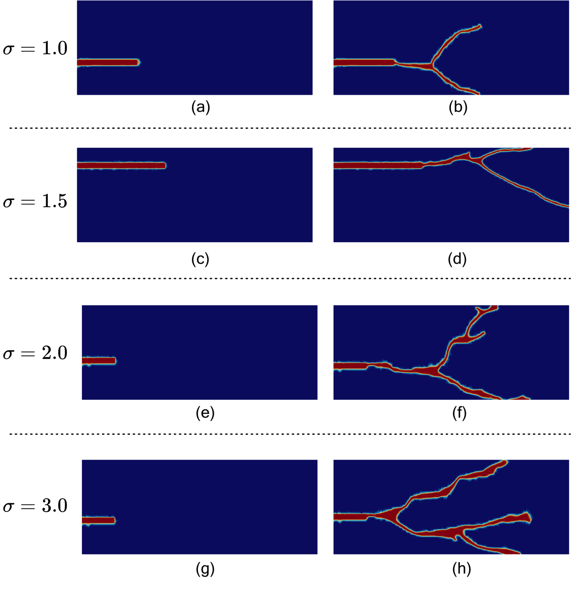

# Benchmark Dataset: Phase-Field Fracture for Dynamic Brittle Fracture under Varying Crack Configurations and Loading

Fracture behavior of dynamically loaded brittle plates with varying initial crack configurations simulated using the adaptive phase-field method in FEniCS. The adaptive phase-field formulation captures complex fracture phenomena including crack nucleation, branching, merging, and arbitrary crack propagation without requiring ad hoc tracking algorithms. This dataset contains finite-element simulations of a 2D rectangular plate with a pre-existing horizontal notch under a traction force, covering diverse crack tip positions and traction magnitudes. 

---

## Full Dataset

Our complete collection covers **varying initial crack locations** and **four normalized traction magnitudes**:

| Traction Magnitude (σ\*) | 
|:---:|
| 1.0 |
| 1.5 |
| 2.0 |
| 3.0 |

Each realization stores **displacement and phase-field damage fields** throughout the full loading history at every 5th time step.

The full dataset is publicly available at:

➡️  https://doi.org/10.7281/T1IDANWZ

**Dataset Contents**

- `Data_description_dynamic_fracture.pdf` — Documentation of model setup, geometry, and boundary conditions.
- `consolidatd_samples.zip` — Raw phase-field fracture results for all realizations.

**Dataset Folder Structure**

```
dataset_dynamic/
  -- metadata.json
  -- consolidated_samples/
       -- Std/ L*
            -- coordinates*.npy
            -- displacement*.npy
            -- phase-field*.npy
       -- Rev/ L*
            -- coordinates*.npy
            -- displacement*.npy
            -- phase-field*.npy
  -- sample_plots/
       -- Std/ L*
       -- Rev/ L*
```

The dataset is organized hierarchically by initial crack direction (`Std` — standard, `Rev` — reversed), load level (`L1`, `L1.5`, `L2`, `L3`), and individual sample directories. Each sample contains coordinate, displacement, and phase-field arrays in NumPy format.

---

## Problem Setup

The computational domain is a **rectangular plate of dimensions 100 mm × 40 mm** containing a pre-existing horizontal notch. A uniform tensile traction σ\* is applied simultaneously on the top and bottom boundaries.

- Initial crack tip positions are systematically sampled within the plate domain.
- Material parameters are held fixed across all simulations (see data description PDF for full table).
- Four traction magnitudes span loading regimes from steady propagation to branching and coalescence.

---

## Visualizations

Below are representative samples showing the **phase-field damage** evolution and **crack paths** for different crack configurations and loading magnitudes.

**Geometry and Boundary Condition Setup**

Geometry and boundary condition setup for the dynamic fracture simulations. A rectangular plate of dimensions 100 mm × 40 mm contains a pre-existing horizontal notch. A uniform tensile traction σ\* is applied simultaneously on the top and bottom boundaries. The distributions of initial crack tip positions across the crack configurations are shown, where *s* and *r* denote the initial crack lengths considered, and blue dots show the crack tip locations sampled within the plate domain.

<p align="center">
  
</p>

**Initial and Final Phase-Field Crack Configurations for All Traction Magnitudes**

Initial (left column) and final (right column) phase-field crack configurations for a representative sample under each of the four traction magnitudes: σ\* = 1.0 (a,b), 1.5 (c,d), 2.0 (e,f), and 3.0 (g,h). At lower loading (σ\* = 1.0), the crack propagates and branches into a single symmetric fork. As the loading magnitude increases, the fracture pattern becomes progressively more complex, exhibiting multiple branches and crack coalescence at σ\* = 2.0 and 3.0, demonstrating the range of dynamic fracture regimes captured in the dataset.

<p align="center">
  
</p>


**Standard and Reverse Displacement and Phase Field Profile from Initial to Final Time Step (Animation)**

Animation of the standard and reverse displacement and phase-field damage profile evolution from the initial to the final time step. This illustrates the progression from crack initiation through branching and final fracture under different loading conditions.

**Standard Crack Configuration**
<p align="center">
  
</p>


---

## Applications of this Dataset

### 1. Benchmarking Machine Learning and Deep Learning Models

The dataset's uniform grid format enables direct application of computer vision and data-driven architectures for fracture prediction.

- **CNN Regression**
- **U-Net and Vision Transformers**
- **Transfer Learning and Data Augmentation**

---

### 2. Scientific Machine Learning and Operator Learning

This dataset provides a foundation for **Scientific Machine Learning (SciML)**, enabling hybrid data–physics frameworks for dynamic fracture.

- **Neural Operators (e.g., FNO, DeepONet)**
- **Physics-Informed Neural Networks (PINNs)**
- **Physics-Informed Operator Networks (PI-DeepONet / PINO)**
- **Latent Dynamics Models**

---

### 3. Hybrid FE–NN Surrogate Models

This dataset enables the development of **hybrid finite element–neural network surrogates** that combine physics solvers with learned models.

- Replace expensive dynamic FEniCS solvers with fast neural surrogates for real-time or many-query simulations.
- Train neural models to predict incremental phase-field evolution between time steps.
- Embed neural networks into FE solvers for efficient forward simulation while preserving physical consistency.

---

### 4. Inverse Modeling and Multi-physics Applications

The diverse crack configurations and loading regimes make this dataset ideal for **inverse modeling**, **parameter identification**, and **uncertainty quantification**.

- **Material Parameter Estimation**
- **Crack Configuration Identification**
- **Uncertainty Quantification**
- **Multi-physics Extension**

---

## Cite our Dataset

If you use this dataset in your work, please cite it as follows:

```bibtex
@data{dynamic_fracture_2025,
  author    = {Krishnan, U. Meenu and Chandrababu, Vasudev and Goswami, Somdatta},
  publisher = {Johns Hopkins Research Data Repository},
  title     = {A phase-field dataset for dynamic brittle fracture under
varying crack configurations and loading},
  year      = {2025},
  version   = {V1},
  doi       = {[https://doi.org/10.7281/T1IDANWZ]}
  url       = {https://archive.data.jhu.edu/dataset.xhtml?persistentId=doi:10.7281/T1IDANWZ}
}
```

---

## Contact

In case you need more information, please feel free to contact:

- **U. Meenu Krishnan** — [ukrishn4@jh.edu](mailto:ukrishn4@jh.edu)
- **Prof. Somdatta Goswami** — [somdatta@jh.edu](mailto:somdatta@jh.edu)

---

## Other Datasets

We also have other datasets developed using the phase-field fracture method:

- **Functionally Graded Plates with Inclusions (Quasi-static)**
  GitHub: https://github.com/Centrum-IntelliPhysics/Benchmark_Data_Phase_field_fracture_in_fgm
  DOI: [10.7281/T1RZFI3I](https://doi.org/10.7281/T1RZFI3I)

- **Hyperelastic Multi-Crack Benchmark Dataset**
  GitHub: https://github.com/Centrum-IntelliPhysics/Benchmark-Data--Phase-field-fracture-in-hyperelastic-material
  DOI: https://doi.org/10.7281/T1XFF19O 

---

## Acknowledgment

This work was supported by the **U.S. Department of Energy (DOE)** under award number **DE-SC0024162**,

*Physics and Uncertainty Informed Latent Operator Learning.*

---

*© 2025 Johns Hopkins University. All rights reserved.*
